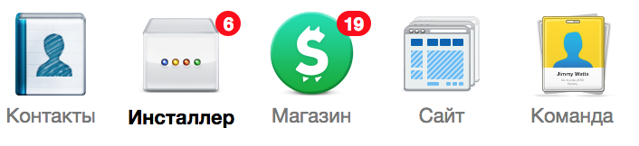
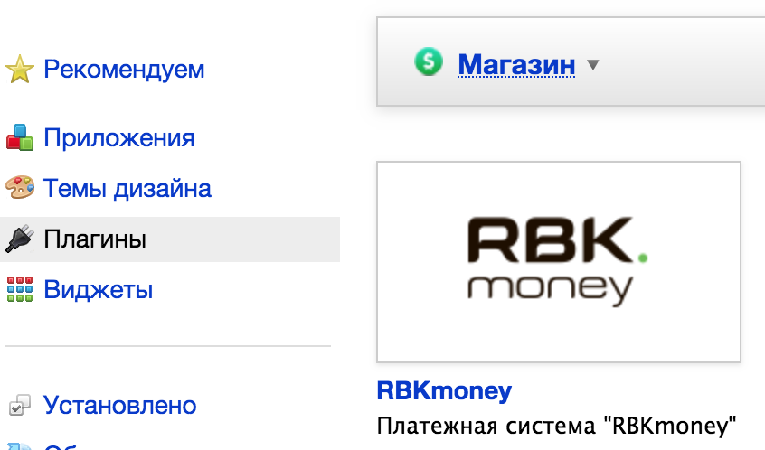
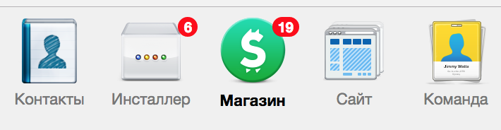
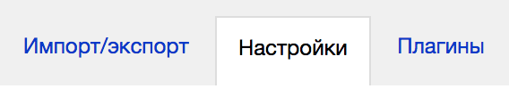
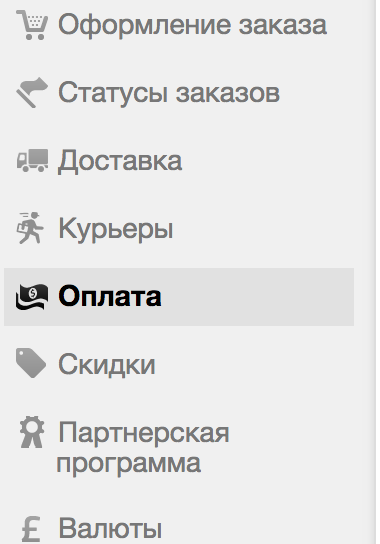
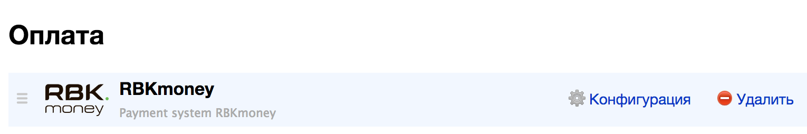
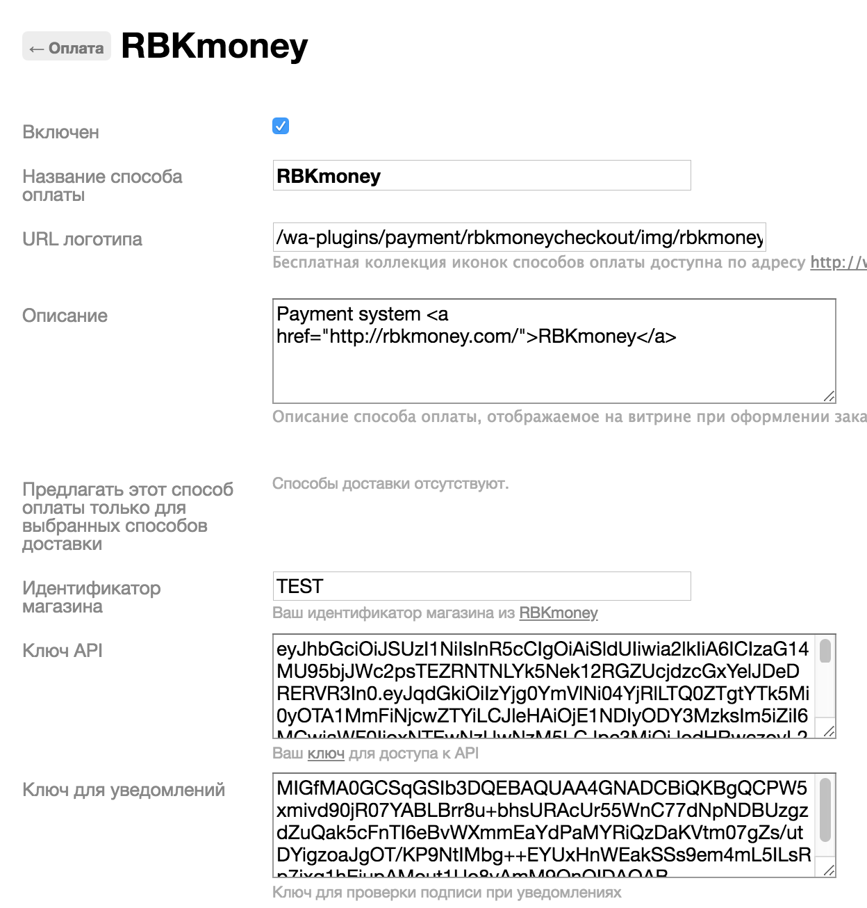

# rbkmoney-cms-shop-script

Пожалуйста, обязательно делайте бекапы!

Платежный плагин RBKmoney для Shop-Script

Модуль разрабатывался и тестировался на Webasyst 1.7.17.186, Shop-Script 7.2.18.169

#### Требования

- PHP 5.4 (минимум)
- OpenSSL - 1.0.2k-fips (минимум)
- Curl

#### Доступные ставки НДС для корзины

- ничего не указано - без НДС
- 0 - 0% НДС
- 10 - 10% НДС
- 18 - 18% НДС

### Установка и настройка модуля

#### Установка вручную

Для установки модуля скопируйте папку `rbkmoneycheckout` в `/wa-plugins/payment`

#### Установка из Инсталлера

Выберите `Инсталлер`, как показано на изображении

Нажимаем в левом меню на `Плагины`, как показано на изображении, вводим в строке поиска RBKmoney и устанавливаем плагин

После установки модуля переходим в настройки магазина, кликнув на иконку `Магазин`

В появившемся меню справа выбираем `Настройки` и перемещаемся в настройки самого магазина

В настройках магазина в левом меню выбираем `Оплата`

Находим модуль `RBKmoney` и нажимаем `Конфигурация`

Теперь осталось заняться настройкой самого модуля.

#### Для начала приема платежей на Вашем сайте осталось совсем немного

В панели администрирования модуля активируйте его и заполните необходимыми настройками

Настройте плагин в соответствии с данными из [личного кабинета RBKmoney](https://dashboard.rbk.money).

`Идентификатор магазина` - идентификатор магазина из RBKmoney. Скопируйте его в Личном кабинете RBKmoney в разделе Детали магазина, поле Идентификатор;

`Ключ API` - ключ для доступа к API. Скопируйте его в Личном кабинете RBKmoney в разделе API Ключ

`Ключ для уведомлений` - ключ для обработки уведомлений о смене статуса

- Заходим в личный кабинет RBKmoney: Создать Webhook;
- Вставляем в поле URL вида `http(s)://your-site/payments.php/rbkmoneycheckout/`, скопированного из `URL для уведомлений`
- Выбираем Типы событий `InvoicePaid` и `Invoice Canсelled`;
- после создания Webhook-а копируем Публичный ключ после нажатия `Показать детали`;
- скопированный ключ вставляем в поле `Ключ для уведомлений` на странице настроек модуля;

- Сохраните изменения и проведите тестовый платеж

### Нашли ошибку или у вас есть предложение по улучшению модуля?

Пишите нам на `support@rbkmoney.com`

При обращении необходимо:

- Указать наименование CMS и компонента магазина, а также их версии
- Указать версию платежного модуля (доступна на странице Управление пакетами)
- Описать проблему или предложение
- Приложить снимок экрана (для большей информативности)
